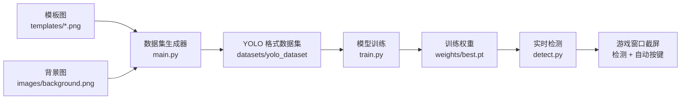
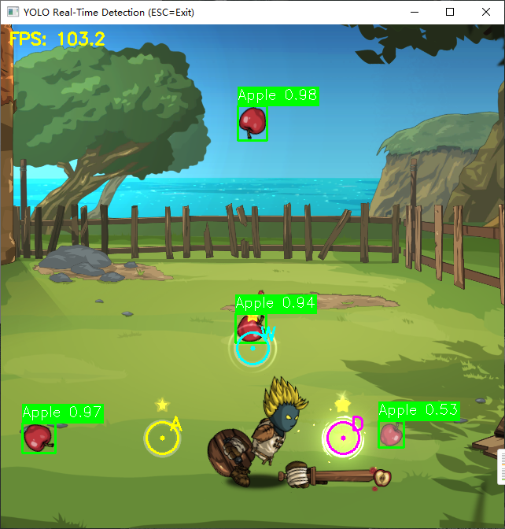

# YoloDemo

> **合成数据集 → YOLO 训练 → 游戏画面实时检测 + 自动按键** 的完整目标检测流程示例（目标游戏：*Swords & Souls: Neverseen*）

本项目演示了一个**没有真实标注数据**场景下的完整目标检测工作流：

1. **数据集合成**：只需要几张带透明背景的目标模板图（PNG），通过随机背景、旋转、缩放、颜色扰动、模糊、噪声、压缩模拟等增强手段，自动生成数千张 YOLO 格式训练图像，**无需人工标注**；
2. **模型训练**：使用合成数据集对 YOLO26n 预训练权重进行微调，得到目标检测模型；
3. **实时检测**：持续截取游戏窗口中下方的 640×640 区域进行目标检测，当目标进入预设的“触发圆圈”时自动模拟按下对应按键（A/W/D），实现“自动按键”效果。



## 主要特性

- **全自动数据集生成**：一键 `python main.py`，自动输出 YOLO 格式数据集与 `data.yaml`
- **丰富的数据增强**：
  - 7 种随机背景：纯色、线性渐变、径向渐变、噪声纹理、网格、棋盘格、从 `background.png` 随机裁剪
  - 目标随机旋转（-180°~180°）、随机缩放、HSV 色相/饱和度/明度偏移、亮度/对比度扰动
  - 后处理模拟真实截图：高斯模糊、高斯噪声、JPEG 压缩
- **一键 YOLO 微调训练**：输出训练曲线、P/R/F1、混淆矩阵、PR 曲线及 `best.pt` / `last.pt` 权重
- **实时窗口截屏检测**：基于 pywin32 + BitBlt，截取任意窗口客户区的指定区域，叠加检测框与 FPS
- **可配置触发圆圈**：检测框中心进入圆圈时自动按下对应按键，带防抖（进入瞬间触发一次，停留在圈内不重复触发）
- **参数集中管理**：生成参数集中在 `config.py`，运行参数集中在 `window_config.json`，无需改代码

## 项目结构

```
YoloDemo
├── main.py                 # 入口：生成 YOLO 格式合成数据集
├── dataset_generator.py    # 合成数据集核心逻辑（背景生成 / 增强 / 标注 / 划分）
├── config.py               # 数据集生成参数（数量、增强范围、背景权重等）
├── train.py                # YOLO 训练脚本
├── detect.py               # 实时游戏窗口截屏 + 检测 + 自动按键
├── test_datasets.py        # 数据集标注可视化检查工具
├── window_config.json      # 运行时配置：游戏窗口、截取区域、触发圆圈等
├── yolo26n.pt              # YOLO26n 预训练权重（训练初始权重）
├── templates/              # 目标模板图（每个类别一张透明背景 PNG）
│   ├── Apple.png           # 类别：Apple
│   └── ThrowBronze.png     # 类别：ThrowBronze
├── images/
│   └── background.png      # 背景素材（用于“从背景图随机裁剪”类型，建议 ≥640×640）
├── datasets/               # 生成的数据集（train/val 图片 + 标注 + data.yaml）
└── runs/                   # 训练输出（权重、结果曲线、验证图等）
```

## 环境要求

| 项目 | 要求 |
| --- | --- |
| 操作系统 | Windows 10 / 11（窗口截屏与按键模拟依赖 pywin32） |
| Python | 推荐 3.10 – 3.12 |
| GPU | 训练建议 NVIDIA GPU + CUDA（CPU 训练很慢）；纯检测可运行于 CPU |
| 环境管理 | 推荐 Conda（非必须） |

## 环境搭建

### 1. 创建并激活 Conda 环境

```bash
conda create -n yolo_env python=3.12 -y
conda activate yolo_env
```

> 不使用 Conda 的话，用 `python -m venv venv` 创建虚拟环境后执行第 2 步的 `pip install` 即可。

### 2. 安装依赖

```bash
# 如需训练，先安装 CUDA 版 PyTorch（按本机 CUDA 版本选择，以下以 cu124 为例）
pip install torch torchvision --index-url https://download.pytorch.org/whl/cu124

# 安装其余依赖
pip install ultralytics opencv-python pillow numpy pywin32
```

> 只运行实时检测（已有训练好的权重）时，不安装 CUDA 版 torch 也可以，Ultralytics 会自动回退到 CPU 推理。

### 3. 验证安装

```bash
yolo check
```

## 快速开始

### 第 1 步：准备模板图

在 `templates/` 目录下放入**每个目标类别一张透明背景 PNG**，文件名（不含扩展名）即为类别名。当前示例包含两个类别：

- `Apple.png`（苹果）
- `ThrowBronze.png`（投掷物）

可选：在 `images/` 下放入 `background.png`（分辨率 ≥ 640×640），用作“从背景图随机裁剪”类型背景，让合成图更接近真实游戏画面。

### 第 2 步：调整数据集参数（可选）

编辑 `config.py`，例如首次试验时可以把每类图像数量调小：

```python
NUM_IMAGES_PER_CLASS = 2000   # 每个类别生成的图像数量
```

完整参数说明见 [config.py 参数说明](#configpy数据集生成)。

### 第 3 步：生成数据集

```bash
python main.py
```

输出目录 `datasets/yolo_dataset/` 结构如下：

```
datasets/yolo_dataset/
├── data.yaml        # 数据集描述（路径、类别数、类别名）
├── train/
│   ├── images/      # 训练图像（640×640 JPEG）
│   └── labels/      # YOLO 格式标注（cls cx cy w h，均为归一化值）
└── val/
    ├── images/
    └── labels/
```

训练集 / 验证集按 `TRAIN_RATIO`（默认 8:2）划分，每张图像随机放置 1~5 个目标并自动避开过大重叠。

### 第 4 步：检查数据集质量（可选）

```bash
python test_datasets.py
```

打开窗口逐张展示训练图像及其标注框：按任意键查看下一张，按 **ESC** 退出。建议先抽查确认合成数据符合预期再开始训练。

### 第 5 步：训练模型

```bash
python train.py
```

`train.py` 中的关键参数：

| 参数 | 值 | 说明 |
| --- | --- | --- |
| 初始权重 | `yolo26n.pt` | 仓库自带的 YOLO26n 预训练权重 |
| `epochs` | 100 | 训练轮数 |
| `imgsz` | 640 | 训练图像尺寸 |
| `batch` | 16 | 批大小（显存不足时调小） |
| `device` | 0 | 使用第一块 GPU |
| `patience` | 20 | 早停耐心值 |

训练完成后，输出目录（默认 `runs/detect/datasets/runs/train/`，以实际运行路径为准）包含：

- `weights/best.pt`：验证集上表现最好的权重（**detect.py 默认加载它**）
- `weights/last.pt`：最后一轮权重，以及每 `save_period` 轮保存的 `epochN.pt`
- `results.csv`、`results.png`、P/R/F1/PR 曲线、混淆矩阵、验证可视化图等

> 如果训练权重的实际路径与 `detect.py` 中的 `MODEL_PATH` 不一致，请同步修改 `detect.py` 顶部的 `MODEL_PATH`。

### 第 6 步：配置游戏窗口

编辑 `window_config.json`：

```json
{
  "window_title": "Swords & Souls Neverseen",
  "window_class": "UnityWndClass",
  "crop_width": 640,
  "crop_height": 640,
  "crop_x_ratio": 0.5,
  "crop_y_ratio": 1.0,
  "confidence_threshold": 0.5,
  "action_enabled": true,
  "action_circles": [
    { "center_x": 205, "center_y": 525, "radius": 20, "key": "a" },
    { "center_x": 320, "center_y": 411, "radius": 20, "key": "w" },
    { "center_x": 435, "center_y": 525, "radius": 20, "key": "d" }
  ]
}
```

关键说明：

- **窗口定位**：`window_title` 支持部分匹配（不区分大小写），`window_class` 需精确匹配（不区分大小写）；
- **截取区域**：`crop_width/height` 定义截取尺寸（与训练图像尺寸一致）；`crop_x_ratio=0.5` 表示水平居中，`crop_y_ratio=1.0` 表示垂直底部对齐——即截取游戏窗口**中下方**的 640×640 区域；
- **触发圆圈**：`action_circles` 中的坐标**相对于截取区域的左上角**；`key` 为目标进入圆圈时自动按下的按键；
- 其余显示项（线宽、字号、是否显示标签/FPS、显示缩放）见 [window_config.json 参数说明](#window_configjson运行时)。

### 第 7 步：运行实时检测

```bash
python detect.py
```

- 弹出检测窗口，实时显示截取画面、检测框（类别 + 置信度）与 FPS；
- 若 `action_enabled` 为 `true`，画面上会画出各触发圆圈，当检测框中心（置信度 ≥ `confidence_threshold`）**从圈外进入圈内**的瞬间，自动按下对应按键；目标停留在圈内不会重复触发，离开后再进入会再次触发；
- 按 **ESC** 退出程序。

## 配置说明

### config.py（数据集生成）

| 参数 | 默认值 | 说明 |
| --- | --- | --- |
| `IMAGES_DIR` | `images` | 背景素材目录（`background.png`） |
| `TEMPLATES_DIR` | `templates` | 模板图目录（每类一张透明 PNG） |
| `OUTPUT_DIR` | `datasets/yolo_dataset` | 数据集输出目录 |
| `NUM_IMAGES_PER_CLASS` | 2000 | 每个类别生成的图像数量 |
| `ROTATION_RANGE` | (-180, 180) | 模板随机旋转角度范围（度） |
| `SCALE_RANGE` | (0.5, 0.5) | 模板缩放比例范围（0.5 为游戏内实际显示比例） |
| `IMAGE_SIZE` | (640, 640) | 输出图像尺寸（宽, 高） |
| `OBJECTS_PER_IMAGE` | (1, 5) | 每张图像中的目标数量范围 |
| `MAX_OVERLAP_RATIO` | 0.4 | 目标间最大允许 IoU，超过则重新放置 |
| `TRAIN_RATIO` | 0.8 | 训练集占比 |
| `FOREGROUND_COLOR_AUGMENT` | True | 前景颜色增强开关（HSV/亮度/对比度） |
| `FOREGROUND_HSV_SHIFT` | (0.05, 0.3, 0.3) | HSV 偏移范围（色相, 饱和度, 明度） |
| `FOREGROUND_BRIGHTNESS_RANGE` | (0.7, 1.3) | 亮度因子范围，1.0 表示不变 |
| `FOREGROUND_CONTRAST_RANGE` | (0.8, 1.3) | 对比度因子范围，1.0 表示不变 |
| `POST_PROCESS_AUGMENT` | True | 后处理增强开关（模拟真实截图） |
| `POST_BLUR_SIGMA_RANGE` | (0.0, 0.8) | 高斯模糊 sigma 范围 |
| `POST_NOISE_STD_RANGE` | (0.0, 8.0) | 高斯噪声标准差范围 |
| `POST_JPEG_QUALITY_RANGE` | (75, 100) | JPEG 压缩质量范围（越低噪点越多） |
| `BACKGROUND_TYPE_WEIGHTS` | 见文件 | 各背景类型生成概率：solid / linear_gradient / radial_gradient / noise / grid / checker / from_image |

### window_config.json（运行时）

| 字段 | 默认值 | 说明 |
| --- | --- | --- |
| `window_title` | - | 游戏窗口标题（部分匹配） |
| `window_class` | - | 游戏窗口类名（精确匹配），Unity 游戏通常为 `UnityWndClass` |
| `crop_width` / `crop_height` | 640 | 截取区域宽 / 高 |
| `crop_x_ratio` | 0.5 | 截取区域水平位置（0=最左, 0.5=居中, 1=最右） |
| `crop_y_ratio` | 1.0 | 截取区域垂直位置（0=顶部, 1=底部） |
| `confidence_threshold` | 0.5 | 检测置信度阈值（低于该值不显示、不触发按键） |
| `box_thickness` | 2 | 检测框线宽 |
| `font_scale` | 0.6 | 标签字号 |
| `show_labels` / `show_conf` | true | 是否显示类别名 / 置信度 |
| `show_fps` | true | 是否显示 FPS |
| `display_scale` | 1.0 | 检测窗口显示缩放 |
| `action_enabled` | false | 自动按键总开关 |
| `action_circles` | [] | 触发圆圈列表：`center_x` / `center_y`（相对截取区域左上角）、`radius`、`key` |

## 如何应用到其他游戏 / 目标

1. 截取游戏中目标对象的清晰画面，**去除背景**后保存为透明背景 PNG，放入 `templates/`（每类一张，文件名即类别名）；
2. （推荐）截取一张真实游戏画面存为 `images/background.png`，提高背景真实性；
3. 按目标在游戏中的实际显示大小调整 `config.py` 中的 `SCALE_RANGE`；
4. 依次执行：`python main.py`（生成数据集）→ `python test_datasets.py`（抽查）→ `python train.py`（训练）；
5. 按游戏窗口实际布局修改 `window_config.json`（窗口标识、截取区域、触发圆圈坐标）；
6. `python detect.py` 运行实时检测。

## 常见问题

**Q：提示未找到游戏窗口？**
检查 `window_title` / `window_class` 是否正确。可用下面的脚本列出所有可见窗口的标题和类名：

```python
import win32gui

def cb(hwnd, _):
    if win32gui.IsWindowVisible(hwnd):
        print(hwnd, repr(win32gui.GetWindowText(hwnd)), win32gui.GetClassName(hwnd))

win32gui.EnumWindows(cb, None)
```

Unity 引擎游戏窗口类名通常是 `UnityWndClass`。

**Q：自动按键没有效果？**
按键事件通过 `keybd_event` 发送到**当前前台窗口**，请确保游戏窗口处于激活/聚焦状态；同时确认 `action_enabled` 为 `true`、圆圈坐标正确、检测置信度能超过 `confidence_threshold`。

**Q：检测精度不理想？**
- 增大 `NUM_IMAGES_PER_CLASS`，让模型见更多样本；
- 让模板与游戏内渲染尽量一致（`SCALE_RANGE` 设为游戏内实际比例、模板取自真实截图）；
- 使用真实游戏画面作为 `background.png`；
- 适当增大训练轮数或关闭早停（`patience` 调大）。

**Q：训练太慢 / 显存不足？**
调小 `batch`，减少 `epochs`，或换用更轻量的基础权重（如 `yolo11n.pt`，同时修改 `train.py` 中的文件名）。

**Q：CPU 下检测 FPS 低？**
有 NVIDIA 显卡时请安装 CUDA 版 torch（见[环境搭建](#2-安装依赖)），Ultralytics 会自动使用 GPU 推理；也可以适当缩小截取区域尺寸（需重新训练）。

## 注意事项

- 本项目依赖 pywin32，**仅支持 Windows** 系统；
- 本仓库自带基础权重 `yolo26n.pt` 与示例训练产物；若训练产物（`runs/`）或生成的大批量图像（`datasets/yolo_dataset/train|val`）体积过大，已在 `.gitignore` 中排除，需要时重新生成即可；
- 本项目的“自动按键”功能会模拟输入，仅供**学习与研究**使用。请在遵守游戏服务条款及所在地区法律法规的前提下，仅在个人环境中使用。
